# PaC-workshop with Kyverno

## Pre-Requisites
To get the most out of this workshop, you'll need the following:

* **kubectl** [Install kubectl](https://kubernetes.io/docs/tasks/tools/)
* **kustomize** [Install kustomize](https://kubectl.docs.kubernetes.io/installation/kustomize/)
* Access to a Kubernetes cluster.  You can use a local single-node cluster environment such as:
   * **kind:** [Installation Guide](https://kind.sigs.k8s.io/docs/user/quick-start/)
   * **minikube:** [Installation Guide/](https://minikube.sigs.k8s.io/docs/start/)
   * **k3d:** [Installation Guide](https://k3d.io/v5.4.6/usage/)
* Docker Desktop [Installation Guide](https://docs.docker.com/desktop/)
* **helm:** To install Kyverno OSS [Install helm](https://helm.sh/docs/intro/install/)
* An IDE/ vim to customize the policies
* [Nirmata CLI](https://docs.nirmata.io/docs/nctl/installation/)

  

Workshop lab guide for extending governance to Kubernetes clusters using Nirmata Cluster Control Point and Kyverno.

## Nirmata Account

Visit [Nirmata Signup](https://nirmata.io/security/signup.html) to register for a free 15-day trial account.

### Activating Account

After registering for an account, the user should receive an email with instructions on how to activate their account. If an email is not received, check your spam filters or other processes that could be blocking this email. If all that does not resolve the issue, contact [Nirmata Customer Support](https://nirmata.com/contact-us).

If the activation email is received, click the **Activate Account** button.

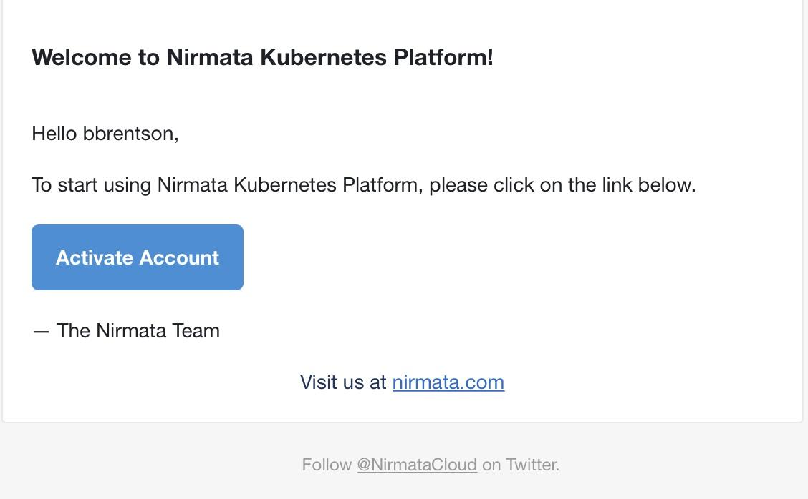

This will open a web browser and take the user to a Nirmata page in order to create the user's initial password. Supply a password meeting or exceeding the requirements listed on the page.

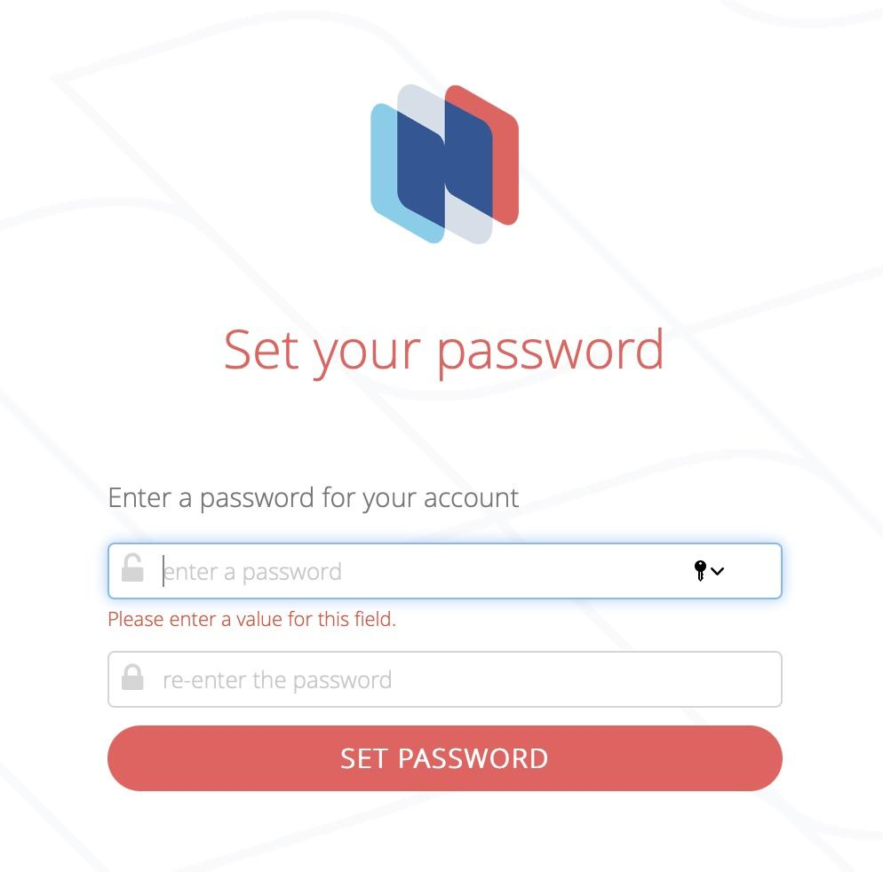

## Nirmata API Token

Log in to [Nirmata](https://nirmata.io/security/login.html), go to **Settings → Profile**, click **Generate API Key**.

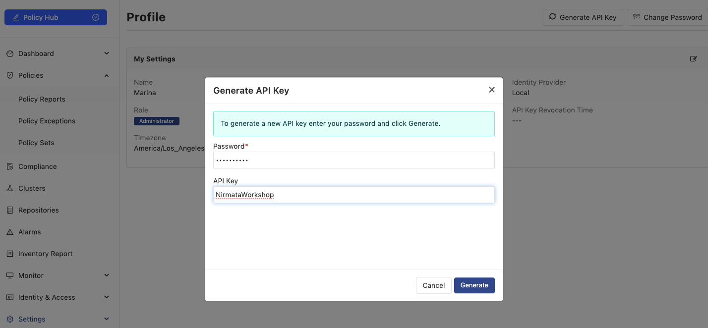

## Cluster Control Point

### Extending Governance to Kubernetes Clusters

With Cloud Control Point protecting your cloud infrastructure, it's time to implement governance at the Kubernetes cluster level. Cluster Control Point leverages Kyverno to enforce policies directly within your Kubernetes clusters.

### The Power of In-Cluster Policy Enforcement

Cluster Control Point provides:

1. **Runtime Policy Enforcement**: Block non-compliant resources from being created or modified
2. **Background Scanning**: Identify existing resources that violate policies
3. **Automated Remediation**: Fix non-compliant resources automatically
4. **Centralized Reporting**: View policy violations across all clusters in one place

### What You'll Implement

In this section, you'll:

- Register your Kubernetes cluster with Nirmata Control Hub
- Deploy the Nirmata Controller to enable policy enforcement
- Apply policy sets for security and compliance
- View and analyze policy violation reports

By the end of this section, you'll have a fully governed Kubernetes cluster with policies enforcing security best practices and compliance requirements.

Let's begin by registering your cluster with Nirmata Control Hub.

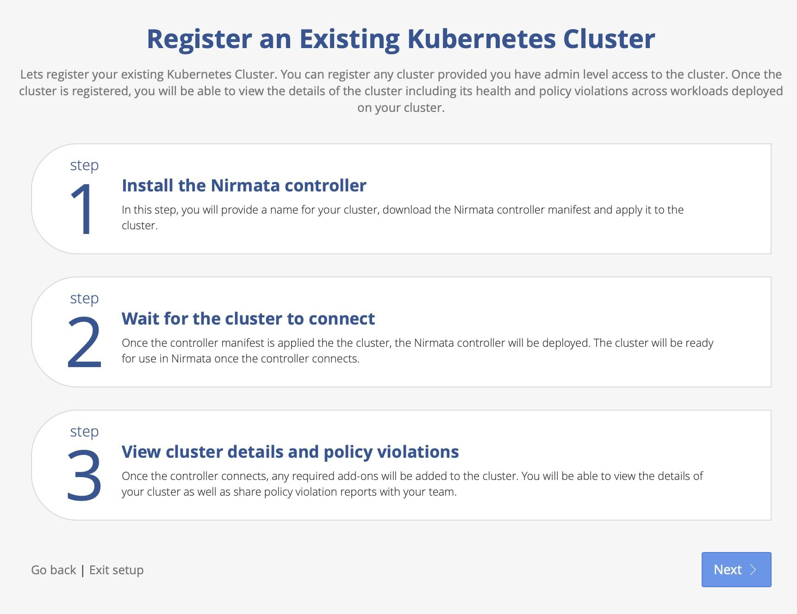

## Cluster Onboarding

In this section, you'll onboard your EKS cluster to Nirmata for policy management and compliance monitoring.

### Step 1: Add Your Cluster in Nirmata

Click on the **Add Cluster** button on the *Clusters* panel.

Enter the cluster name as `demo-aws-cluster` (required) and labels (optional).

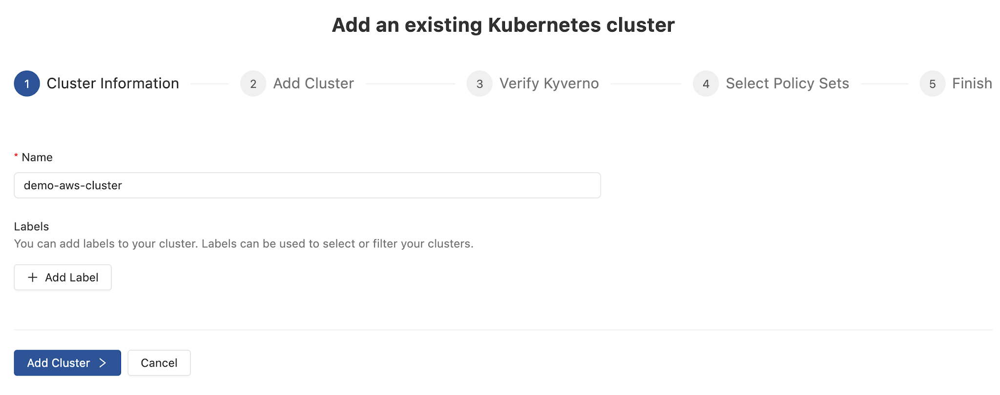

After entering the cluster information, click on **Add Cluster** to proceed to the next step.

### Step 2: Onboard Cluster

There are 2 ways to onboard the cluster — using the NCTL tool or using a Helm chart (both tools are pre-installed on the VS Code environment). We will use Helm. Simply copy the commands and run them in the VS Code terminal. Once completed, click **I Have Run The Commands - Verify Kyverno**.

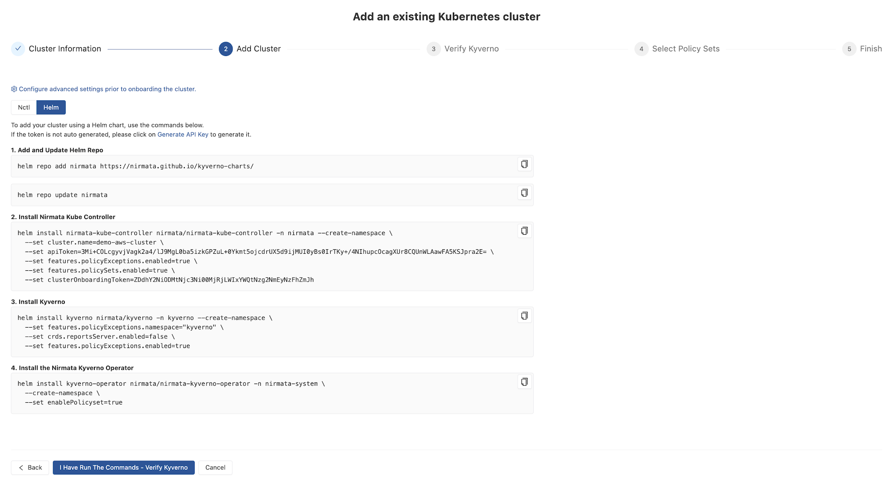

### Step 3: Verify Kyverno Setup

You should receive the message *Kyverno detection is complete*. Now you can move to **Select Policy Sets**.

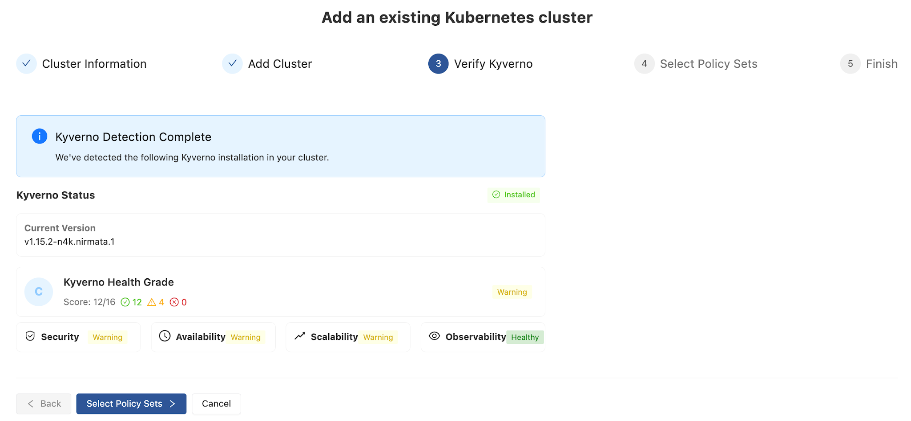

### Step 4: Select Recommended Policy Sets

Nirmata detects the minimum recommended policy sets which you can leave selected for the workshop. For your cluster setup, please follow your organization security and compliance guidelines. Click **Apply Policy Sets** to complete onboarding.

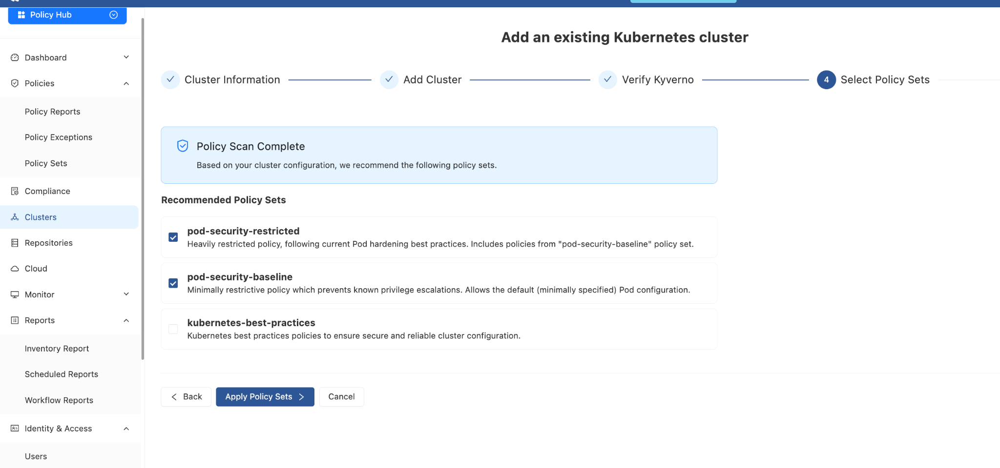

### Step 5: Verify Policy Status

NCH will perform policy sets deployment and verification of policy sets status.

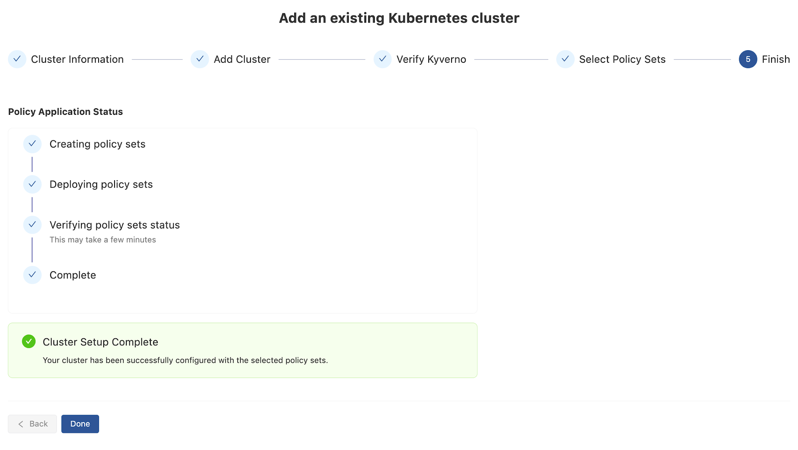

## Policy Sets and Policy Reports

### Adding Policy Set

It is not mandatory to use Nirmata's curated policy sets. Navigate to *Policy Sets* and click on **Add Policy set** → *Add Custom Policy Set*. This option provides more control over the lifecycle of the underlying policies.

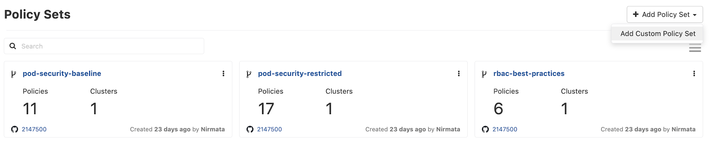

The page displays two options to create a policy set: **Git** (recommended) and **YAML**.

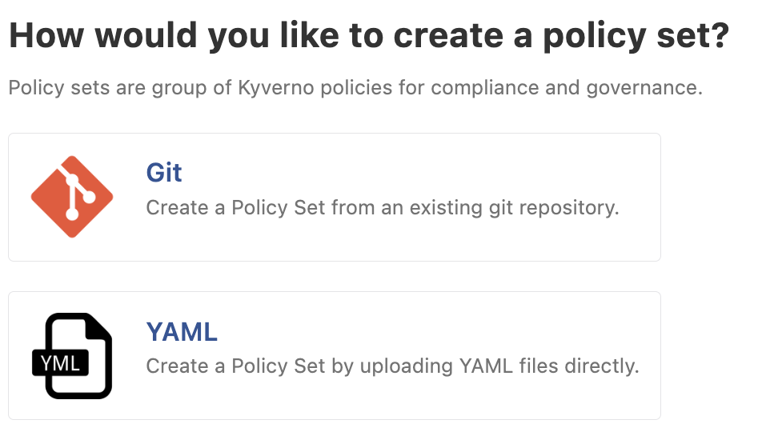

Click on Git and add the settings for the repo like below:

- **Name**: `custom-demo-policies`
- **Repository**: https://github.com/nirmata/demo-ws-nirmata
- **Branch**: `main`
- **Path**: `/Docs-and-Guides/Nirmata-policies/restricted-psp-audit/`

You can leave the rest as default, and click on **Create**.

You can now add a cluster to the policy set by clicking on the top right corner of the policy set, and navigate to **Clusters**, and selecting **Add cluster** in the top right corner.

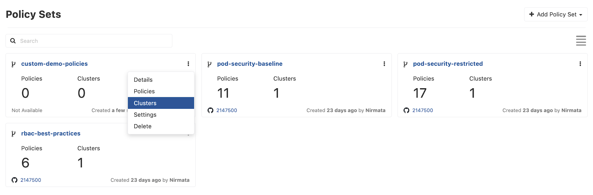

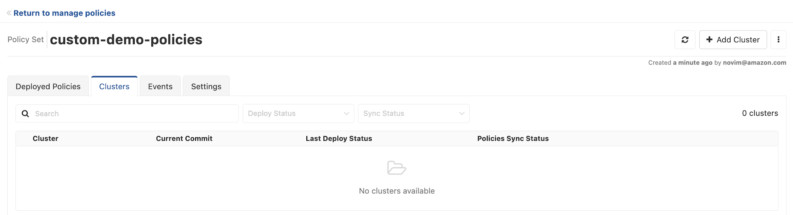

Monitor the policies deployed, and we are all set to view the policy reports.

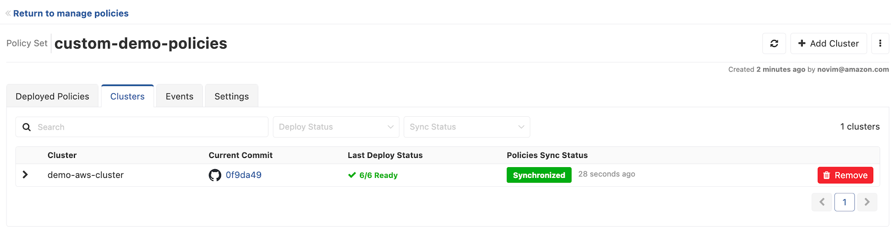

The policies are configured for `nginx` and `demo` namespace and do not show the violation for all the resources. Create both the namespace and deploy some [sample insecure workloads](https://github.com/nirmata/demo-ws-nirmata/tree/main/Docs-and-Guides/Nirmata-policies/insecure%20workloads) to test the violations.

**To access the Policy Reports:**

1. Go to **Policies** → **Policy Reports**. The Policy Reports can be viewed based on Categories, Clusters, Namespaces, or Repositories.

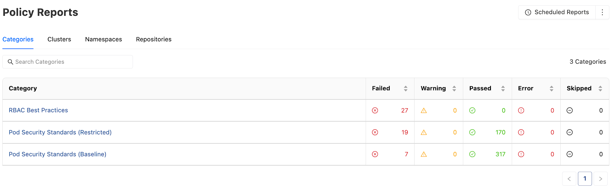

2. To view the Policy Reports in any one category, click on the Category Name (example, **RBAC Best Practices**) link. The findings in this category will be displayed with information related to *Severity, Findings, Impact (Clusters and Resources), and Status (%Pass or Fail)*.

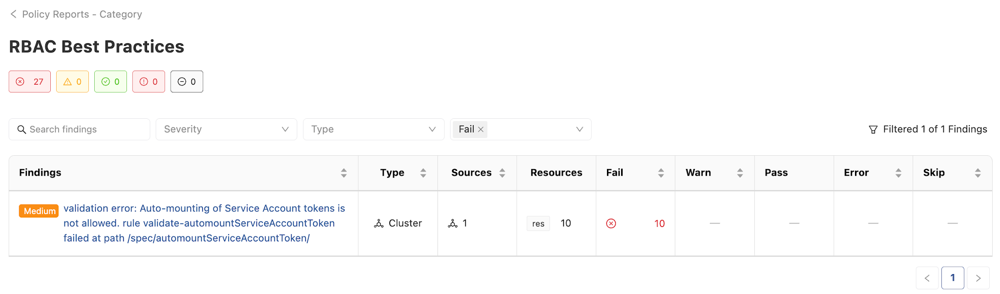

3. To view detailed report of a particular finding, click on any **Findings** link to view the details and its impact. The details contain violation and policy information as the policy name, rule name, severity of the violation, and other metadata. The page also lists the impacted resources for this finding.

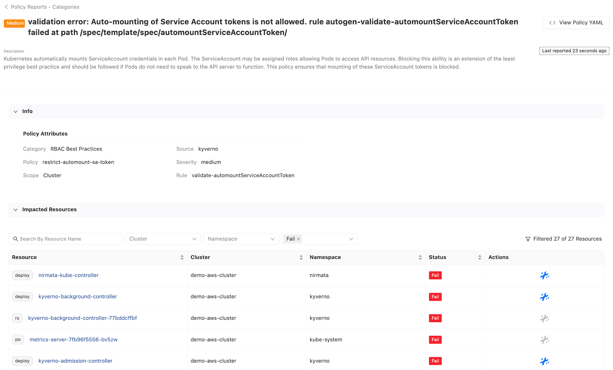

You can click on the blue icon and check out the remediation.

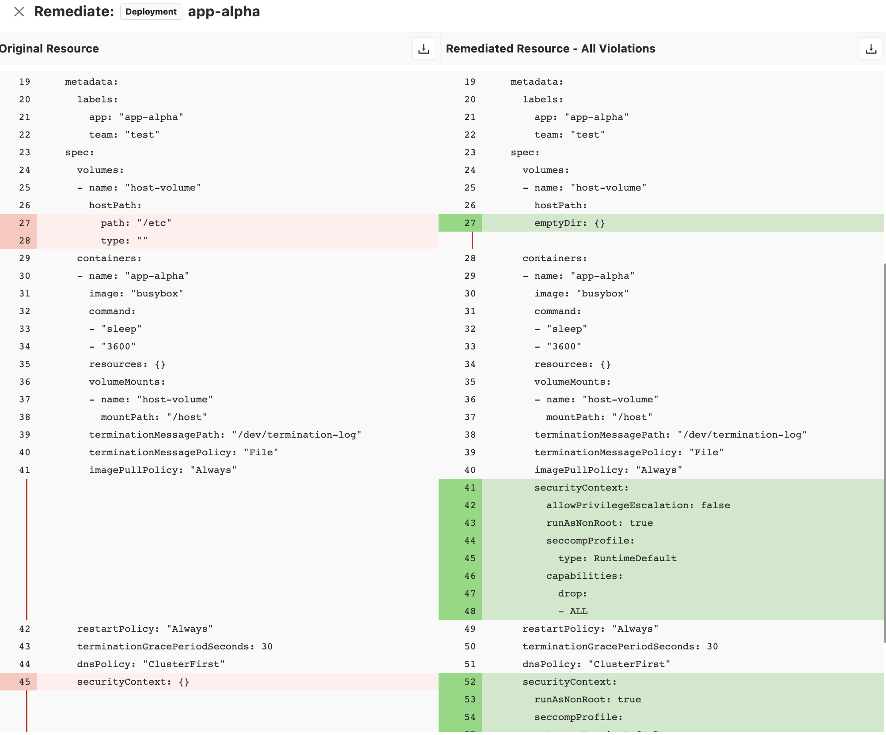

You can also:

- [Schedule report](https://docs.nirmata.io/docs/npmk/workflows/auto_report_scheduling/)
- Assign a violation to a user using the [Jira integration](https://docs.nirmata.io/docs/npmk/policy_reports/create_jira_tickets/)

## Use Agentic AI to Generate Kyverno Policies

We will use `nctl ai` to generate governance policies for AI workloads.

Start nctl ai:

```bash
nctl ai
```

Run quickstart:

```bash
quickstart
```

This will provide you with an overview of your cluster.

Use the following prompt to generate a policy that governs the AI workloads:

```
Generate a Kyverno ClusterPolicy for Pods in the ai-workloads namespace that requires:

1. CPU and memory requests and limits
2. livenessProbe and readinessProbe
3. nodeSelector karpenter.sh/nodepool=general-purpose
4. automountServiceAccountToken set to false

Use validationFailureAction Enforce.
```

Review the generated output.


The reference policies is available at [`policies/ai-workload-standards.yaml`](policies/ai-workload-standards.yaml).

## Sample Application

Deploy the sample insecure workloads included in this repository to test policy violations:

```bash
kubectl create ns sample-app
kubectl apply -f sample-app/app.yaml -n sample-app
```
